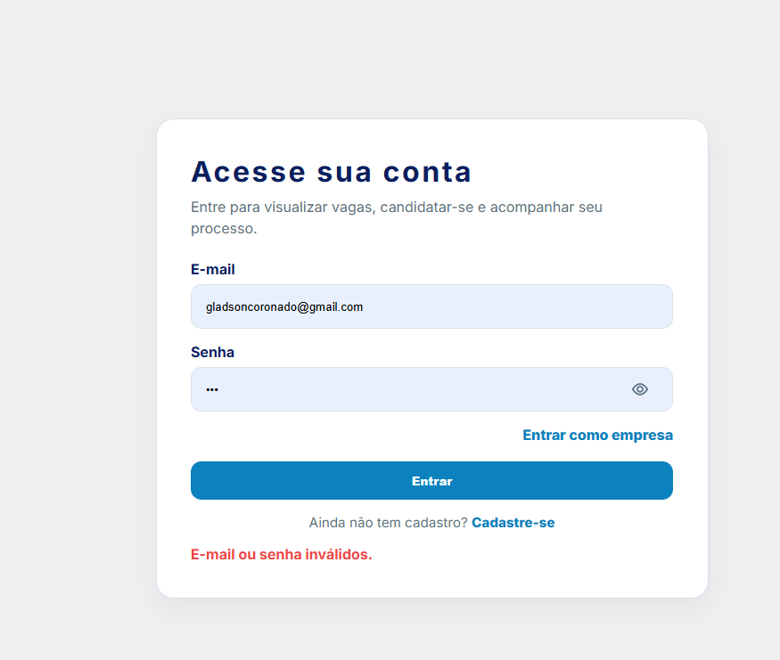
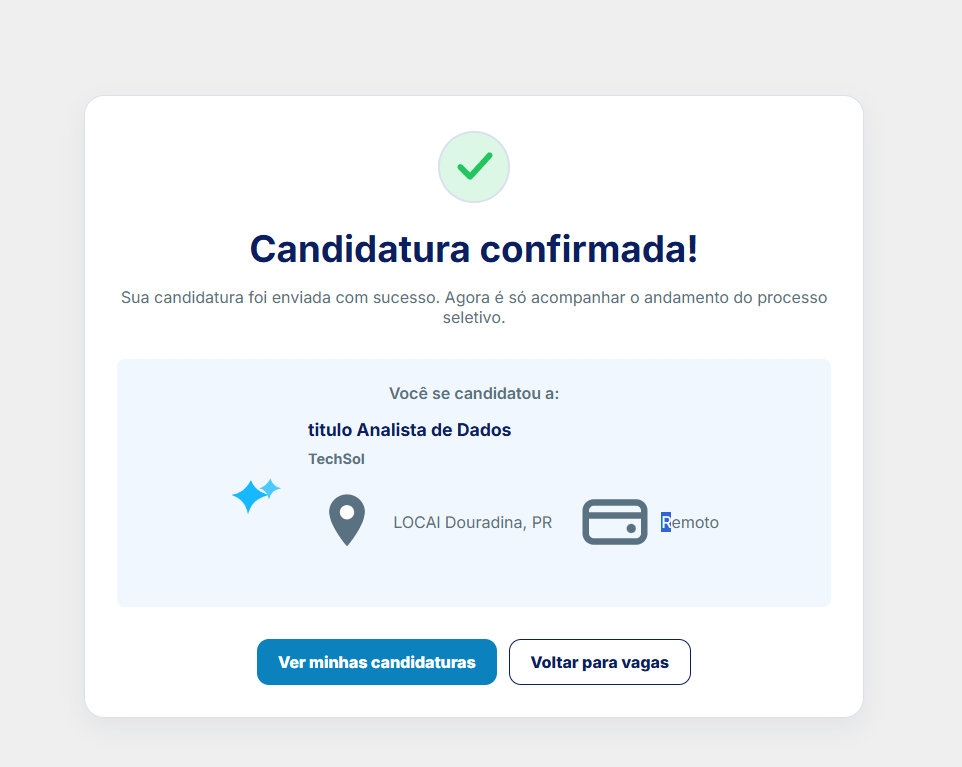
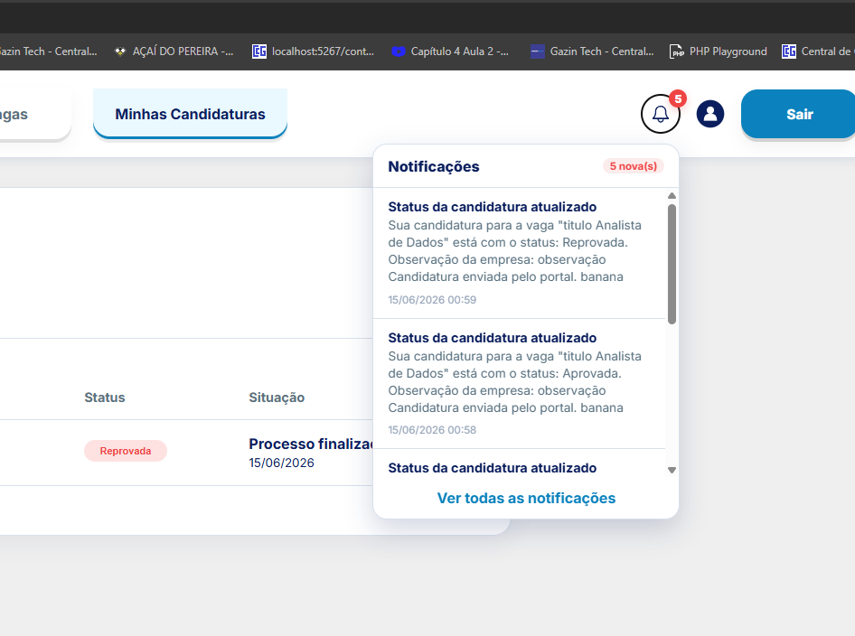
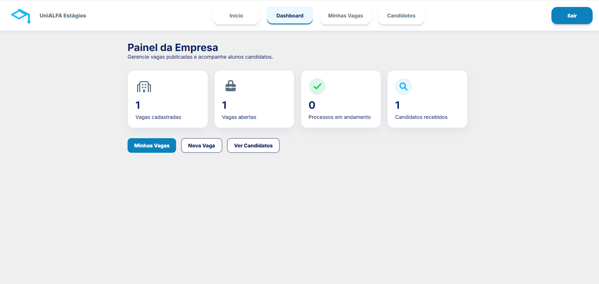
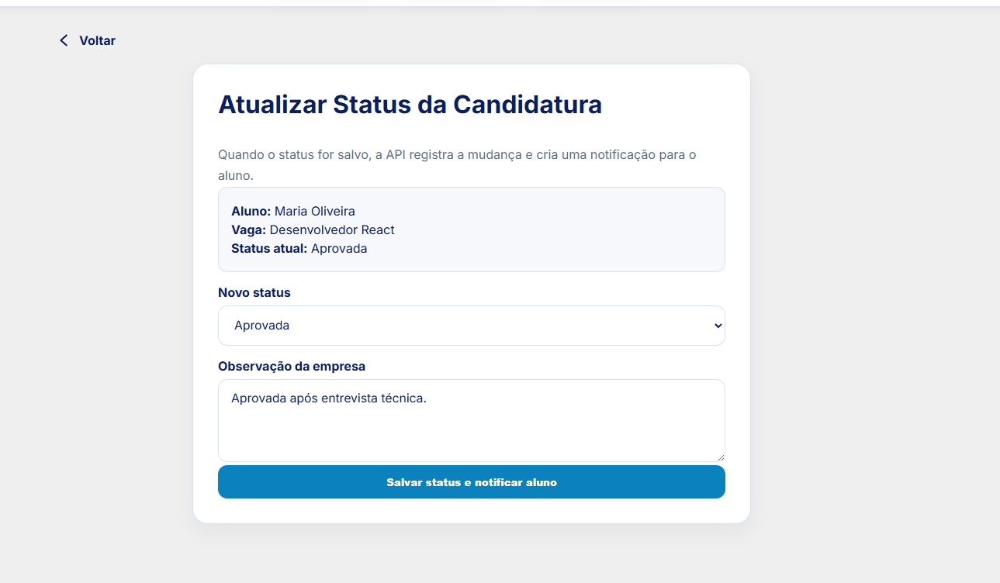
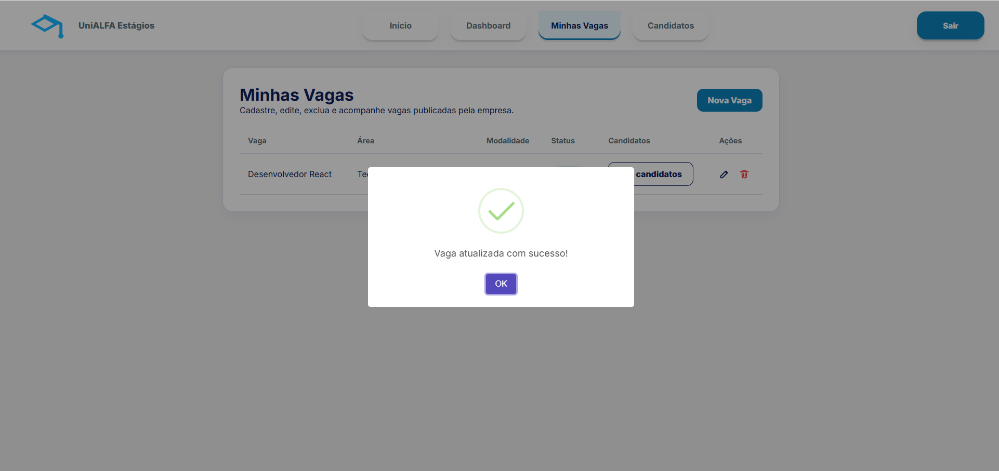

# Hackathon Web - Portal de Estágios UniALFA

## 1. Descrição do projeto

O `Hackathon-web` é a camada web do Portal de Estágios UniALFA, desenvolvida em PHP com aplicação de conceitos de Programação Orientada a Objetos.

O sistema atende dois públicos:

- **Alunos**, que podem se cadastrar, consultar vagas, enviar candidaturas e acompanhar processos seletivos;
- **Empresas**, que podem se cadastrar, gerenciar suas próprias vagas e acompanhar os candidatos recebidos.

O projeto funciona como interface para a API RESTful desenvolvida em Node.js. Toda leitura ou alteração de dados é realizada por requisições HTTP com respostas JSON. O PHP **não acessa o banco MySQL diretamente**.

### Objetivos

- aproximar alunos das oportunidades de estágio publicadas por empresas parceiras;
- oferecer uma jornada simples de candidatura e acompanhamento;
- permitir que empresas administrem vagas e candidatos em uma área restrita;
- manter a persistência e as regras de negócio centralizadas na API Node.js;
- oferecer uma interface visual coerente, legível e responsiva.

## 2. Tecnologias utilizadas

| Tecnologia | Utilização |
|---|---|
| PHP 8 | Controllers, models, sessões, roteamento e integração HTTP |
| Programação Orientada a Objetos | Encapsulamento dos models, herança de controllers e separação de responsabilidades |
| HTML5 | Estrutura semântica das páginas e formulários |
| CSS3 | Identidade visual, componentes, estados, tabelas e responsividade |
| JavaScript | Máscaras, notificações, perfil flutuante e interações de interface |
| Apache | Servidor web e reescrita de URLs pelo `.htaccess` |
| XAMPP ou Laragon | Ambiente local para execução do PHP/Apache |
| API Node.js | Autenticação, vagas, candidaturas, empresas, alunos e notificações |
| JSON e HTTP | Formato e protocolo de integração com a API |
| Google Fonts | Fonte `Inter` utilizada pela interface |
| SweetAlert2 | Mensagens modais de sucesso, erro e aviso |
| SVG | Ícones, logotipo e indicadores visuais |

O projeto utiliza PHP e JavaScript puros, sem framework web ou dependências instaladas por Composer.

## 3. Como executar localmente

### Pré-requisitos

- PHP 8 ou superior;
- Apache com `mod_rewrite` habilitado;
- `AllowOverride` habilitado para o uso do `.htaccess`;
- `allow_url_fopen` habilitado no PHP, pois o cliente HTTP utiliza `file_get_contents`;
- projeto `Hackathon-api` configurado e executando;
- MySQL disponível para a API Node.js.

### 3.1 XAMPP

Coloque o projeto dentro do diretório `htdocs`. No ambiente usado durante a validação, o caminho foi:

```text
C:\xampp\htdocs\nova\Hackathon-web
```

Inicie o **Apache** e o **MySQL** pelo painel do XAMPP.

Com essa estrutura, acesse:

```text
http://localhost/nova/Hackathon-web/
```

Se o projeto for colocado diretamente em `C:\xampp\htdocs\Hackathon-web`, a URL será:

```text
http://localhost/Hackathon-web/
```

### 3.2 Laragon

Coloque o projeto no diretório:

```text
C:\laragon\www\Hackathon-web
```

Inicie o servidor web pelo Laragon. A URL dependerá da configuração adotada:

```text
http://localhost/Hackathon-web/
```

ou:

```text
http://hackathon-web.test/
```

O domínio local pode variar conforme o nome da pasta e a configuração de virtual hosts do Laragon.

### 3.3 Iniciar a API Node.js

Em outro terminal, acesse o projeto da API:

```powershell
cd C:\xampp\htdocs\nova\Hackathon-api
npm install
npm run migration:run
npm run dev
```

Para carregar os dados de demonstração em um banco preparado para testes:

```powershell
npm run seed
```

> O seed é opcional e repopula tabelas de negócio. Não o execute sobre um banco com dados que precisam ser preservados.

A API local deve responder em:

```text
http://localhost:3000
```

Teste antes de abrir o front:

```text
http://localhost:3000/health
```

### 3.4 Configurar a URL da API

A URL prevista para configuração está em:

```text
config/app.php
```

Valor local:

```php
'api_url' => 'http://localhost:3000/api',
```

O cliente HTTP também possui o mesmo endereço como fallback em:

```text
core/ApiClient.php
```

> **Observação técnica:** na versão atual, o `ApiClient` procura a configuração em `app/config/app.php`, enquanto o arquivo versionado está em `config/app.php`. Como o fallback possui a URL local correta, a execução em `localhost:3000` funciona. Para utilizar outra URL, é necessário alinhar esse caminho de configuração em uma futura correção ou manter o fallback atualizado.

## 4. Estrutura do projeto

```text
Hackathon-web/
|-- app/
|   |-- Controllers/
|   |-- Models/
|   `-- Views/
|       |-- admin/
|       |-- aluno/
|       |-- auth/
|       |-- empresa/
|       |-- errors/
|       `-- layouts/
|-- config/
|   `-- app.php
|-- core/
|   |-- ApiClient.php
|   |-- Controller.php
|   |-- Router.php
|   `-- helpers.php
|-- public/
|   |-- assets/
|   |-- css/
|   `-- js/
|-- .htaccess
`-- index.php
```

### `app/Controllers`

Coordena os fluxos da aplicação, valida a sessão, recebe dados dos formulários, chama os models e escolhe a view que será apresentada.

Principais controllers:

- `AuthController`: home, cadastro, login e logout;
- `AlunoController`: vagas, candidatura, acompanhamento, notificações, currículo e perfil;
- `EmpresaController`: estados da empresa, dashboard, vagas, candidatos e status;
- `AdminController`: autenticação e usuários institucionais.

### `app/Models`

Encapsula as operações de cada entidade e sua comunicação com a API:

- `Aluno`;
- `Empresa`;
- `Vaga`;
- `Candidatura`;
- `Notificacao`;
- `Usuario`.

As classes obrigatórias definidas no documento do Hackathon, `Aluno`, `Empresa`, `Vaga` e `Candidatura`, estão presentes.

### `app/Views`

Contém os templates PHP/HTML separados por área:

- autenticação e cadastro;
- portal do aluno;
- painel da empresa;
- administração;
- páginas de erro;
- componentes de layout.

### `core`

Contém a infraestrutura compartilhada:

- `ApiClient`: requisições HTTP para a API;
- `Controller`: renderização, redirecionamento, sessão e autorização;
- `Router`: mapeamento das URLs;
- `helpers`: URLs, sanitização, formatação e componentes auxiliares.

### `public`

Reúne arquivos públicos:

- folha de estilo principal;
- JavaScript de interface;
- imagens;
- ícones e badges em SVG.

### `index.php`

É o front controller da aplicação. Inicializa os recursos e registra as rotas públicas, do aluno, da empresa e da administração.

## 5. Integração com a API

O projeto não utiliza `PDO`, `mysqli` ou instruções SQL. A comunicação ocorre exclusivamente por HTTP por meio da classe:

```text
core/ApiClient.php
```

O cliente oferece métodos para:

```php
get()
post()
put()
patch()
delete()
```

Quando existe uma sessão autenticada, o token recebido no login é enviado no cabeçalho:

```http
Authorization: Bearer TOKEN
```

### Principais integrações

| Recurso | Endpoints utilizados |
|---|---|
| Autenticação | `POST /api/login` |
| Alunos | `POST /api/alunos`, `GET/PUT /api/alunos/:id` |
| Empresas | `POST /api/empresas`, `GET /api/empresas/:id` |
| Vagas públicas | `GET /api/vagas/ativas`, `GET /api/vagas/:id` |
| Vagas da empresa | `GET /api/vagas/empresa/:id`, `POST/PUT/DELETE /api/vagas` |
| Candidaturas | `POST /api/candidaturas`, `GET/PUT /api/candidaturas` |
| Notificações | `GET /api/notificacoes`, `PATCH /api/notificacoes/:id/lida` |
| Usuários institucionais | Endpoints em `/api/usuarios` |

O banco de dados, as migrations, os seeds e as regras centrais pertencem ao projeto `Hackathon-api`.

## 6. Portal do Aluno

### Cadastro e login

- cadastro com nome, e-mail, telefone, curso, período e senha;
- confirmação de senha no cadastro do aluno;
- autenticação pela API;
- armazenamento do token e dos dados do aluno na sessão PHP;
- mensagem de erro para credenciais inválidas;
- aviso quando o cadastro ainda não foi considerado apto pela instituição.

### Listagem e detalhes das vagas

- consulta das vagas ativas pela API;
- apresentação em cards;
- exibição de título, empresa, área, modalidade, local e bolsa;
- página de detalhes;
- bloqueio visual de vagas indisponíveis.

### Candidatura

O fluxo implementado segue esta jornada:

1. acesso ao portal;
2. consulta das vagas disponíveis;
3. abertura dos detalhes;
4. confirmação da candidatura;
5. envio à API;
6. tela de candidatura confirmada;
7. acompanhamento em `Minhas Candidaturas`.

A candidatura exige sessão de aluno e aptidão para estágio. A API também valida aptidão, estado da vaga, empresa e duplicidade.

### Acompanhamento

- listagem das candidaturas do aluno;
- filtros para todas, em andamento e finalizadas;
- estados `Enviada`, `Em análise`, `Aprovada` e `Reprovada`;
- visualização das observações registradas pela empresa.

### Notificações

- contador de notificações não lidas;
- dropdown no menu;
- aviso após o login;
- página com histórico;
- ação para marcar uma notificação como lida.

As notificações são fornecidas pela API quando uma candidatura é criada ou atualizada.

### Perfil e currículo

- consulta e edição dos dados básicos do aluno;
- tela de currículo;
- visualização do currículo básico pela empresa;
- exibição da situação de aptidão para estágio.

> **Limitação atual:** a API persiste nome, e-mail, telefone, curso e período. Os campos complementares apresentados no formulário, como LinkedIn, objetivo, formação, experiência, idiomas e habilidades, ainda precisam ser incluídos no contrato da API e no banco para serem armazenados.

## 7. Painel da Empresa

### Cadastro e login

- cadastro com nome, e-mail, CNPJ, telefone e senha;
- autenticação pela API;
- armazenamento do token em sessão;
- redirecionamento conforme o estado cadastral.

### Estados da empresa

| Estado | Comportamento |
|---|---|
| `PENDENTE` | Exibe tela de cadastro em análise e bloqueia a gestão de vagas/candidatos |
| `APROVADA` | Libera dashboard, vagas e candidatos |
| `BLOQUEADA` | Exibe aviso institucional e bloqueia as operações restritas |

O status é consultado novamente na API durante a navegação para refletir alterações feitas pelo backoffice institucional.

### Dashboard

Apresenta indicadores de:

- vagas cadastradas;
- vagas abertas;
- processos em andamento;
- candidatos recebidos.

Também oferece acessos rápidos para vagas, criação de nova vaga e candidatos.

### CRUD de vagas

A empresa aprovada pode:

- cadastrar vagas;
- listar suas próprias vagas;
- editar dados e status;
- excluir vagas com confirmação;
- filtrar candidatos por vaga.

Os formulários incluem título, descrição, requisitos, bolsa, modalidade, área, local, carga horária, atividades e status.

### Candidatos e currículo

- listagem dos alunos candidatos às vagas da empresa;
- filtro por vaga;
- visualização dos dados básicos do candidato;
- consulta de curso, período, contato e aptidão;
- acesso à candidatura e sua observação.

### Atualização de status

A empresa pode alterar a candidatura para:

- `Em análise`;
- `Aprovada`;
- `Reprovada`.

Também pode registrar uma observação. A atualização é enviada à API, responsável por criar a notificação do aluno.

## 8. UX/UI

### Identidade visual

A interface utiliza a marca **UniALFA Estágios**, acompanhada por um símbolo relacionado à formação acadêmica. A composição visual utiliza tons de azul, fundos claros, cartões brancos, bordas suaves e cantos arredondados.

As telas fornecidas como referência demonstram consistência entre o portal do aluno e o painel da empresa, com navegação superior, estado ativo destacado, ícones e componentes reutilizáveis.

### Tipografia

A fonte principal é:

```text
Inter: 400, 600, 700 e 800
```

O sistema utiliza títulos com maior peso, textos auxiliares em cinza azulado e botões com contraste visual.

### Paleta principal

As cores abaixo estão definidas como variáveis em `public/css/style.css`:

| Uso | Variável | Cor |
|---|---|---|
| Azul de destaque | `--azul` | `#16B9FF` |
| Azul escuro/texto | `--azul-escuro` | `#0B1F5E` |
| Azul dos botões | `--azul-botao` | `#0B82BD` |
| Texto secundário | `--cinza-azul` | `#597180` |
| Fundo principal | `--fundo` | `#EFEFEF` |
| Bordas | `--borda` | `#D9E1EC` |
| Superfícies | `--branco` | `#FFFFFF` |
| Sucesso | `--verde` | `#22C55E` |
| Erro | `--vermelho` | `#EF4444` |

### Organização das telas

- barra de navegação superior;
- menus específicos para aluno e empresa;
- destaque para a seção ativa;
- cards para vagas, etapas e métricas;
- tabelas para candidaturas, vagas e candidatos;
- formulários centralizados e agrupados;
- botões primários e secundários consistentes;
- estados vazios e páginas de erro.

### Mensagens de erro, aviso e sucesso

- alertas vermelhos para erro;
- alertas amarelos para avisos;
- alertas verdes para sucesso;
- modais SweetAlert2 após operações;
- tela dedicada para candidatura confirmada;
- mensagens para vaga indisponível, cadastro não apto e empresa pendente/bloqueada;
- badge, dropdown e toast para notificações.

### Experiência do aluno

A jornada prioriza a consulta rápida de vagas e reduz o fluxo de candidatura a poucas etapas. O aluno recebe confirmação visual e pode acompanhar o processo sem sair do portal.

### Experiência da empresa

O painel apresenta indicadores resumidos, atalhos para as principais ações e tabelas voltadas ao trabalho de recrutamento. A separação entre vagas, candidatos e atualização de status reduz a complexidade da navegação.

### Responsividade e acessibilidade

O CSS possui media queries e adaptações de layout para desktop, tablet e celular. A interface foi validada nas seguintes larguras:

| Largura | Dispositivo simulado | Resultado |
|---|---|---|
| 1440px | Desktop | Funcionando |
| 768px | Tablet | Funcionando |
| 390px | Celular | Funcionando |
| 320px | Celular compacto | Funcionando |

A interface também possui recursos básicos de acessibilidade:

- estilos de `focus-visible`;
- `role="alert"` e `role="status"` em mensagens;
- textos alternativos em imagens relevantes;
- regiões de tabela identificadas;
- contraste definido para textos e botões.

### Evidências visuais da interface

As capturas abaixo registram telas implementadas no sistema e complementam as evidências textuais de UX/UI e funcionamento.

#### Login do aluno e tratamento de erro

<p align="center">
  
</p>

*Formulário de autenticação com hierarquia visual, campos identificados e retorno de erro.*

#### Confirmação da candidatura

<p align="center">
  
</p>

*Retorno visual apresentado após o envio da candidatura, com resumo da vaga e ações de continuidade.*

#### Notificações do aluno

<p align="center">
  
</p>

*Notificações de candidatura e mudança de status integradas à navegação do aluno.*

#### Dashboard da empresa

<p align="center">
  
</p>

*Painel com indicadores resumidos e atalhos para vagas e candidatos.*

#### Atualização do status da candidatura

<p align="center">
  
</p>

*Fluxo empresarial para registrar o status, incluir observação e notificar o aluno.*

#### Confirmação da atualização de vaga

<p align="center">
  
</p>

*Feedback modal apresentado após a atualização de uma vaga da empresa.*

## 9. Evidências de testes manuais

Verificação realizada em ambiente local com Apache, PHP 8.3, API Node.js e MySQL.

| Fluxo | Resultado | Evidência |
|---|---|---|
| Página inicial | Funcionando | HTTP 200 e seleção dos portais |
| Login do aluno | Funcionando | Redirecionamento para `/portal` |
| Login inválido | Implementado | Formulário apresenta mensagem semântica para credenciais inválidas |
| Listagem de vagas | Funcionando | Cards carregados pela API |
| Detalhes da vaga | Funcionando | Rota respondeu HTTP 200 |
| Confirmação da candidatura | Funcionando | Tela de confirmação e referência visual fornecida |
| Envio da candidatura | Implementado | Controller, model e tela de confirmação estão integrados à API |
| Minhas candidaturas | Funcionando | Rota respondeu HTTP 200 com sessão de aluno |
| Notificações | Funcionando | Rota HTTP 200, contador, dropdown e histórico |
| Perfil do aluno | Implementado | Consulta e atualização dos dados básicos |
| Currículo | Implementado | Dados básicos são consultados e apresentados no portal |
| Login da empresa aprovada | Funcionando | Redirecionamento para `/empresa/dashboard` |
| Empresa pendente | Funcionando | Redirecionamento para `/empresa/aguardando-aprovacao` |
| Empresa bloqueada | Implementado | Controller e tela específicos restringem as operações da empresa |
| Dashboard da empresa | Funcionando | HTTP 200 e métricas exibidas |
| Formulário de nova vaga | Funcionando | Rota respondeu HTTP 200 |
| Cadastro de vaga | Implementado | Formulário, model e endpoint de criação estão integrados |
| Edição de vaga | Implementado | Formulário, model e endpoint de atualização estão integrados |
| Exclusão de vaga | Implementado | Tela de confirmação e endpoint de exclusão estão integrados |
| Lista de candidatos | Funcionando | Rota respondeu HTTP 200 |
| Visualização de currículo | Implementado | Exibe os dados básicos retornados pela API |
| Atualização de status | Implementado | Tela, validação e integração com a API estão presentes |
| Responsividade | Funcionando | Validada em 1440px, 768px, 390px e 320px |
| Sintaxe PHP | Funcionando | 47 arquivos verificados com `php -l`, sem erros |

### Ambiente da evidência

| Item | Valor |
|---|---|
| Data da verificação | 15/06/2026 |
| Sistema operacional | Windows |
| Servidor web | Apache/XAMPP |
| PHP | 8.3.30 |
| API | `http://localhost:3000/api` |
| URL do front | `http://localhost/nova/Hackathon-web/` |

## 10. Links UX/UI

- Protótipo de baixa fidelidade: `[INSERIR LINK DO FIGMA]`
- Protótipo de alta fidelidade: `[INSERIR LINK DO FIGMA]`
- Guia de estilo visual: `[INSERIR LINK DO FIGMA]`

O protótipo de alta fidelidade deve apresentar a jornada completa de candidatura, desde a página inicial até a confirmação da candidatura. Os protótipos de baixa fidelidade devem contemplar todas as telas web.

## 11. Aplicação dos requisitos PHP

| Requisito | Evidência no projeto |
|---|---|
| Classes `Aluno`, `Empresa`, `Vaga` e `Candidatura` | `app/Models` |
| Painel restrito da empresa | `EmpresaController` e `app/Views/empresa` |
| CRUD das próprias vagas | Rotas e métodos de criação, listagem, edição e exclusão |
| Lista de candidatos por vaga | Tela de candidatos com filtro |
| Portal do aluno | Vagas, detalhes, candidatura e acompanhamento |
| Integração exclusivamente HTTP | `core/ApiClient.php` |
| Encapsulamento | Models encapsulam chamadas e normalização dos dados |
| Herança | Controllers herdam de `Controller` |
| Separação de responsabilidades | Divisão em controllers, models, views e core |

## 12. Melhorias futuras

- ampliar a persistência do currículo com informações complementares de formação e experiência;
- adicionar testes automatizados para os fluxos de autenticação, vagas e candidaturas;
- manter a documentação visual e os protótipos sincronizados com a evolução da interface.
